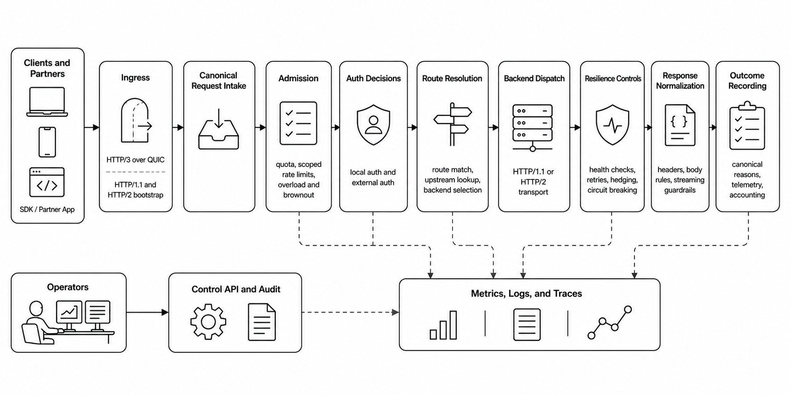

# Spooky

Spooky is a modern edge runtime for high-trust APIs. It sits in front of application traffic, terminates HTTP/3 and QUIC at the edge, routes requests to existing backends, and gives operators explicit control over resilience, policy, and failure handling.

It is designed for teams that need more than basic reverse proxying, especially in environments where latency, availability, traffic contracts, auditability, and clear failure semantics matter.

Spooky is not just a proxy binary. It is an operator-facing traffic layer for teams that want one place to understand, control, and protect critical API traffic.

## Why Spooky

- **Modern edge ingress**: native HTTP/3 over QUIC with a bootstrap HTTP/1.1 and HTTP/2 compatibility path.
- **Clear traffic control**: routing, load balancing, admission, quota, overload protection, retries, hedging, and circuit breaking are explicit runtime concerns.
- **Operator visibility**: metrics, logs, traces, control API views, audit events, dashboards, alerts, and SLO artifacts ship as one observability package.
- **Backend compatibility**: adopt modern client ingress without rewriting existing backend services.

## Built For Operators

Spooky is built for the moments when traffic is no longer normal:

- when latency climbs and teams need to know whether the issue is overload, quota, auth, or backend failure
- when backends are unstable and operators need the edge to absorb pressure instead of amplifying it
- when policy decisions need to be explicit, observable, and auditable
- when platform teams want production-grade dashboards, alerts, and runtime visibility without assembling everything from scratch

## How Spooky Works

Spooky gives teams one runtime to receive traffic, make explicit decisions, protect backends, and surface operator-usable outcomes.



- accepts modern client traffic at the edge
- routes requests by host and path
- evaluates auth, quota, admission, and overload policy separately
- executes upstream traffic through existing HTTP/1.1 or HTTP/2 backends
- protects upstream backends with health-aware resilience controls
- exposes clear operational signals across metrics, logs, traces, control API, and audit

## Core Capabilities

### Edge And Routing

- HTTP/3 and QUIC ingress
- bootstrap HTTP/1.1 and HTTP/2 compatibility ingress
- path and host-based routing
- deterministic route resolution

### Load Balancing And Backend Management

- random
- round-robin
- consistent-hash
- least-connections
- latency-aware
- sticky-cid
- active health checks with automatic removal and recovery

### Resilience And Policy

- admission control and overload shedding
- quota and advanced rate-limit policy pipeline
- retries and hedging
- circuit breaking
- bounded request and response memory behavior

### Observability And Operations

- Prometheus metrics
- structured logs
- OTLP tracing
- control API runtime introspection
- audit events
- shipped Grafana dashboards, recording rules, alerts, and SLO definitions

## Where It Fits

Spooky is a strong fit for:

- fintech and payment infrastructure
- banking and wallet APIs
- trading and market-data edges
- B2B API platforms with strict traffic contracts
- internal platform teams that want modern ingress with stronger operational clarity

## Quick Start

```bash
cargo build --release
make certs-selfsigned
./target/release/spooky --config config/config.development.yaml
```

Then test the edge with an HTTP/3 request:

```bash
curl --http3-only -k \
  --resolve proxy.spooky.local:9889:127.0.0.1 \
  https://proxy.spooky.local:9889/api/health
```

## Configuration

Spooky uses validated YAML configuration.

Useful starting points:

- `config/config.production.yaml`: production-oriented baseline
- `config/config.development.yaml`: local development profile
- `config/config.sample.yaml`: broader reference sample

Recommended docs:

- [Configuration Reference](docs/configuration/reference.md)
- [Examples](docs/configuration/examples.md)
- [TLS Configuration](docs/configuration/tls.md)
- [Distributed Quota Operations](docs/operations/distributed-quota.md)

Minimal example:

```yaml
version: 1

listen:
  protocol: http3
  port: 9889
  address: "0.0.0.0"
  tls:
    cert: "certs/proxy-cert.pem"
    key: "certs/proxy-key-pkcs8.pem"

upstream:
  api_backend:
    load_balancing:
      type: "round-robin"
    route:
      path_prefix: "/api"
    backends:
      - id: "api-1"
        address: "127.0.0.1:8001"
        weight: 100
        health_check:
          path: "/health"
          interval: 5000

log:
  level: info
```

## Architecture

Primary code areas:

- `crates/edge`: ingress, admission, observability, control API
- `crates/bridge`: protocol conversion
- `crates/transport`: upstream connection management
- `crates/lb`: balancing and backend selection
- `crates/config`: configuration parsing, normalization, and validation

## Production And Operations

Spooky is intended for controlled, production-minded deployment:

- Linux runtime
- UDP access for QUIC ingress
- TLS certificate management
- monitoring and alerting in place before rollout

Build dependencies:

```bash
# Ubuntu/Debian
sudo apt install cmake build-essential pkg-config

# macOS
brew install cmake pkg-config
```

Start here for deployment and operations:

- [Getting Started](docs/getting-started/overview.md)
- [Production Deployment](docs/deployment/production.md)
- [Production Readiness](docs/operations/production-readiness.md)
- [Metrics And Alerts](docs/operations/metrics-and-alerts.md)
- [Observability Bundle](docs/operations/observability-bundle.md)
- [Runbook](docs/operations/runbook.md)
- [Troubleshooting](docs/troubleshooting/common-issues.md)

## Project Status

**Beta.** Spooky is suitable for controlled production rollouts, but it remains pre-GA and should be deployed with staged rollout, monitoring, and rollback readiness.

See:

- [Release Maturity](docs/release-maturity.md)
- [Roadmap](docs/roadmap.md)
- [Limitations](docs/reference/limitations.md)

## Documentation

The full documentation index is at [docs/README.md](docs/README.md).

Use these entry points first:

- Start here: [Getting Started](docs/getting-started/overview.md)
- Deploy and operate: [Operations Overview](docs/operations/overview.md)
- Troubleshoot: [Common Issues](docs/troubleshooting/common-issues.md)
- Exact product support and limits: [Reference Overview](docs/reference/overview.md)

Recommended deep links:

- [Architecture Overview](docs/architecture/overview.md)
- [Request Lifecycle](docs/architecture/request-lifecycle.md)
- [Transport Boundaries](docs/architecture/transport.md)
- [Quota Policy Contract](docs/architecture/quota-policy-contract.md)
- [Observability Contract](docs/architecture/observability-contract.md)
- [Control API Reference](docs/reference/control-api-reference.md)
- [Feature Matrix](docs/reference/feature-matrix.md)

## Development

Want to help build Spooky? See our [contribution guidelines](CONTRIBUTING.md).

For a minimal development loop:

```bash
cargo build
cargo fmt
cargo clippy --workspace -- -D warnings
cargo test --workspace
```

For repository structure, testing strategy, and implementation guidance, use:

- [Contributing Guide](CONTRIBUTING.md)
- [Development Overview](docs/development/overview.md)
- [Codebase Map](docs/development/codebase-map.md)
- [Testing Strategy](docs/development/testing-strategy.md)
