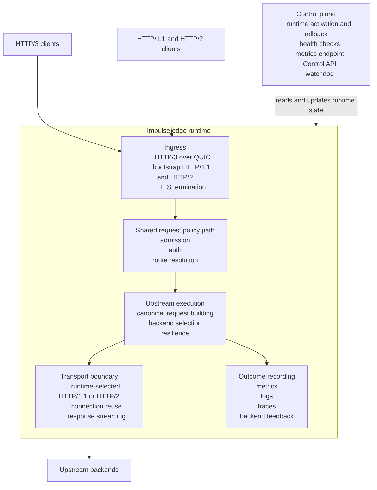
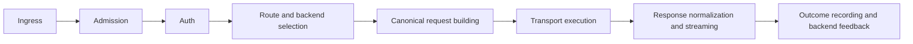

# Architecture Overview

## Introduction

Impulse is a Rust edge runtime for API traffic. It accepts HTTP/3 over QUIC as the primary downstream path, exposes a bootstrap HTTP/1.1 and HTTP/2 compatibility path for clients that are not using native HTTP/3, applies shared policy and routing decisions, and forwards requests to upstream backends over runtime-selected HTTP/1.1 or HTTP/2 transport.

## Read This Section

Use this page as the architecture entry point, then go deeper where needed:

| Topic | Document |
|---|---|
| Product flow from ingress to response | [Request Lifecycle](request-lifecycle.md) |
| QUIC path versus bootstrap compatibility path | [Bootstrap vs QUIC](bootstrap-vs-quic.md) |
| Backend execution and H1/H2 transport boundary | [Transport Boundary](transport.md) |
| Backend resolution, health, and lifecycle state | [Backend Lifecycle](backend-lifecycle.md) |
| Runtime reload and generation ownership | [Runtime Generation Model](runtime-generation.md) |

## Design Principles

### Performance
Impulse is designed for high-performance operation with minimal overhead:
- Zero-copy packet processing where possible
- Lock-free data structures for hot paths
- Asynchronous I/O throughout the stack
- Connection pooling and multiplexing
- Memory-efficient buffer management

### Safety
Built on Rust's memory safety guarantees:
- No unsafe code in core proxy logic
- Type-safe protocol conversions
- Structured error handling with explicit failure modes
- Resource lifetime tracking via ownership

### Operational Simplicity
Simple to deploy and operate:
- Single binary deployment
- YAML-based configuration with validation
- Graceful shutdown with connection draining
- Generation-based runtime reload, staged activation, and rollback for runtime-managed settings
- Comprehensive metrics and logging

### Modularity
Clear separation of concerns across crate boundaries:
- Independent protocol layer implementations
- Pluggable load balancing algorithms
- Isolated configuration management
- Reusable utility components

## System Architecture

### High-Level View



### Plane Comparison

| Plane | Primary responsibility | Examples |
| --- | --- | --- |
| Data plane | Accept, evaluate, route, and forward requests | QUIC ingress, bootstrap ingress, admission, auth, backend selection, transport execution |
| Control plane | Inspect, activate, protect, and observe the runtime | Control API, runtime history, metrics endpoint, watchdog, cert reload, health checks |

### Data Plane and Control Plane

The architecture separates data-plane request handling from operator-facing control-plane work such as configuration activation, health checks, runtime views, and metrics exposure.

**Data Plane:**
- QUIC or bootstrap ingress
- request admission and auth
- route resolution and backend selection
- upstream request execution
- response normalization and streaming

**Control Plane:**
- Configuration loading, validation, preview, activation, and rollback
- Health check execution
- Backend state and runtime-generation views
- Metrics, readiness, and Control API services
- Watchdog and restart coordination

This separation keeps operator tasks out of the hot path and makes runtime state easier to reason about.

## Request Processing Pipeline

Impulse has two ingress paths, but both are expected to converge on the same internal request flow as early as possible.

### Request Flow At A Glance



### 1. Ingress

The request begins on one of two downstream paths:

1. QUIC ingress accepts UDP, performs the QUIC and TLS handshake, and opens HTTP/3 streams.
2. Bootstrap ingress accepts HTTP/1.1 or HTTP/2 requests on the compatibility path.
3. In either case, ingress builds a canonical request context containing method, path, authority, headers, and body-stream state.

### 2. Admission

Admission is the first shared policy gate. It evaluates whether the request should proceed before upstream work begins.

This stage covers:

- quota and scoped rate-limit decisions
- overload and brownout shedding
- inflight and buffer protection
- admission permit acquisition and route-level caps

Quota policy and overload policy are intentionally separate concepts even when both can reject a request.

### 3. Auth

If auth is configured, the request moves through a shared auth decision layer that can:

- allow the request
- deny the request
- challenge or redirect where supported
- fail open or fail closed, depending on policy

### 4. Routing and Backend Selection

After admission and auth succeed:

1. the routing index matches the request to a route
2. the route resolves to an upstream
3. the upstream load-balancing policy selects an eligible backend
4. backend identity and route identity are attached to the request context for observability and downstream policy

### 5. Canonical Request Building

Impulse converts ingress-specific request data into a canonical upstream request:

- pseudo-header and regular-header handling
- host and forwarded-header policy
- websocket and upgrade shaping where bootstrap compatibility requires it
- body mode and streaming decisions

This is the `bridge` boundary, not per-ingress custom header logic.

### 6. Backend Transport Execution

The request is handed to the transport layer together with the selected backend identity.

Transport owns:

- runtime-selected HTTP/1.1 or HTTP/2 execution
- connection reuse
- connect and execution timeouts
- backend client rotation

The edge layer still owns retry and hedge orchestration, but it does not own protocol-specific client behavior.

### 7. Response Normalization and Streaming

When the backend responds:

1. the canonical response-normalization layer strips hop-by-hop headers and applies shared bodyless and no-content rules
2. the ingress path emits the normalized result back to the downstream protocol
3. guardrails enforce body size and idle or total streaming timeouts while bytes continue to flow

QUIC and bootstrap differ here only in downstream write mechanics.

### 8. Outcome Recording and Backend Feedback

Every terminal request path records a shared outcome vocabulary for:

- route and backend outcome metrics
- auth, quota, and overload reason mapping
- retry and hedge results
- backend request feedback and health observations

This is how Impulse keeps observability and backend lifecycle state aligned across both ingress paths.

## Concurrency Model

### Async Runtime

Impulse uses Tokio as its asynchronous runtime:
- Multi-threaded work-stealing scheduler
- Event-driven I/O with epoll/kqueue
- Timer wheel for timeout management
- Cooperative task scheduling

### State Management

Shared state is managed carefully:
- `Arc<T>` for shared ownership (including `Arc<Metrics>` shared across all workers)
- `RwLock<T>` for mutable shared state (upstreams and backend lifecycle state)
- `AtomicU64` for lock-free counters (metrics)
- A `RuntimeBundleHandle` provides an atomically swappable snapshot of runtime state, enabling
  config hot reload without restarting the process

### Task Structure

The data plane is **multi-worker**, not a single primary-thread loop:
- One UDP socket is bound per worker via `SO_REUSEPORT`, and one OS thread is spawned per socket
  (`impulse-data-plane-{idx}`); worker count comes from `performance.worker_threads`.
- Each worker can be further sub-sharded into `performance.packet_shards_per_worker` packet-shard
  threads, fed via bounded `mpsc` channels. Packets are hashed by peer address so a given peer
  always lands on the same shard/connection state.
- Each worker/shard runs its own `recv_from` → QUIC-poll loop; connections are managed in-process.
- Backend requests spawn async tasks via Tokio; graceful drain/shutdown is coordinated per group.

This design scales UDP ingress across cores while keeping each connection pinned to one thread's
state, and leverages Tokio's async capabilities for backend I/O.

## Error Handling Strategy

### Error Categories

**Configuration Errors:**
- Detected at startup during validation
- Cause process to exit before binding sockets
- Examples: invalid TLS paths, malformed YAML, missing required fields

**Protocol Errors:**
- QUIC connection failures, bootstrap request-parse failures, invalid downstream protocol behavior
- Usually isolated to individual connections, requests, or streams
- Do not affect other active connections
- Logged for debugging

**Transport Errors:**
- Backend connection failures, timeouts, HTTP/2 errors
- Trigger backend health state changes
- May cause retry to different backend
- Increment error metrics

**System Errors:**
- Socket errors, TLS failures, resource exhaustion
- May require process restart depending on severity
- Logged at error level with context

### Recovery Mechanisms

**Stream-Level Recovery:**
- Invalid stream fails with HTTP error to client
- Connection remains active for other streams
- Error logged with stream ID

**Backend-Level Recovery:**
- Failed backend marked unhealthy
- Requests routed to healthy backends
- Backend enters cooldown, recovers after success threshold
- Health transitions logged

**Connection-Level Recovery:**
- Failed QUIC connection is closed
- Other connections unaffected
- Client may reconnect

**Process-Level Recovery:**
- Graceful shutdown on SIGTERM/SIGINT
- Drain period allows in-flight requests to complete
- Socket closure after drain timeout

## Configuration Architecture

### Structure

Configuration is hierarchical:
```
Config
├── version: u32
├── listen: Listen (protocol, port, address, TLS)
├── upstream: HashMap<String, Upstream>
│   └── Upstream
│       ├── load_balancing: LoadBalancing
│       ├── route: RouteMatch (host, path_prefix)
│       └── backends: Vec<Backend>
│           └── Backend (id, address, weight, health_check)
└── log: Log (level)
```

### Validation

Configuration validation occurs before runtime:
1. YAML parsing with serde
2. TLS certificate/key file existence checks
3. Backend address format validation
4. Load balancing mode validation
5. Route conflict detection hardening and broader validation ergonomics

### Runtime Behavior

Runtime configuration is loaded at startup and then exposed through a generation-based runtime bundle:

- startup-owned state stays fixed until restart
- generation-owned state is replaced on successful reload
- readers observe complete runtime generations through an atomic bundle swap

See [Runtime Generation Model](runtime-generation.md) for the exact ownership split.

## Security Considerations

### Transport Security

- TLS 1.3 required for all client connections
- Certificate chain validation via rustls
- Private key protection (file permissions)
- ALPN negotiation selects the downstream protocol where TLS listeners require it

### Backend Communication

- Upstream execution currently uses HTTP/1.1 or HTTP/2 transport
- HTTPS backends use upstream TLS with certificate verification enabled by default
- Backend mTLS client-certificate authentication remains a gap
- Connection reuse reduces repeated handshake cost

### Attack Surface

- UDP amplification: QUIC includes mitigation (connection ID validation)
- Resource exhaustion: connection limits, per-backend semaphores
- Request smuggling: strict HTTP/3 to HTTP/2 conversion rules
- Header injection: header validation in bridge module

## Observability

### Logging

Structured logging via Rust's log crate:
- Levels: trace, debug, info, warn, error
- Context includes: connection ID, stream ID, backend, duration
- Configurable log level, adjustable live via config reload (no restart)

### Metrics

Atomic counters for key metrics:
- `requests_total`: all requests received
- `requests_success`: successful responses
- `requests_failure`: failed requests
- `backend_timeouts`: timed out backend requests
- `backend_errors`: backend error responses

Metrics export via Prometheus format (shipped).

### Tracing

Request-level tracing:
- `RequestEnvelope` tracks start time
- Duration calculated on completion
- Logged with request details

Distributed tracing via OpenTelemetry (shipped).

## Performance Characteristics

### Latency

- QUIC handshake: 1-RTT with TLS 1.3
- Proxy-added latency is primarily routing, request shaping, and transport dispatch overhead
- Backend latency usually dominates end-to-end request time
- Streaming responses remain sensitive to downstream and upstream pacing, not only header processing time

### Throughput

- Throughput depends on worker count, packet sharding, backend behavior, and TLS or QUIC cost
- CPU pressure is typically driven by QUIC crypto, request volume, and backend protocol execution
- Capacity planning should be validated with workload-specific benchmarking rather than fixed headline numbers

### Scalability

- Horizontal: stateless design allows multiple instances
- Vertical: multi-worker ingress and Tokio-based backend execution scale across cores
- Backend scaling: dynamic health-based routing
- Connection scaling: bounded by file descriptors and memory

## Future Enhancements

### Planned Features

- Mutual TLS (client certificates) **to backends** — upstream TLS with certificate verification is
  already implemented; client-cert authentication toward backends is the remaining gap
- Upstream HTTP/3 forwarding
- Richer service-discovery integrations

_Already shipped (previously listed here as planned): active HTTP health-check probes, per-client
scoped rate limiting, per-backend circuit breakers, and the admin/control API for runtime
inspection and hot reload._

### Architectural Improvements

- Lock-free routing table
- Connection state persistence for zero-downtime restart
- eBPF integration for packet-level optimizations
- QUIC 0-RTT support for returning clients
